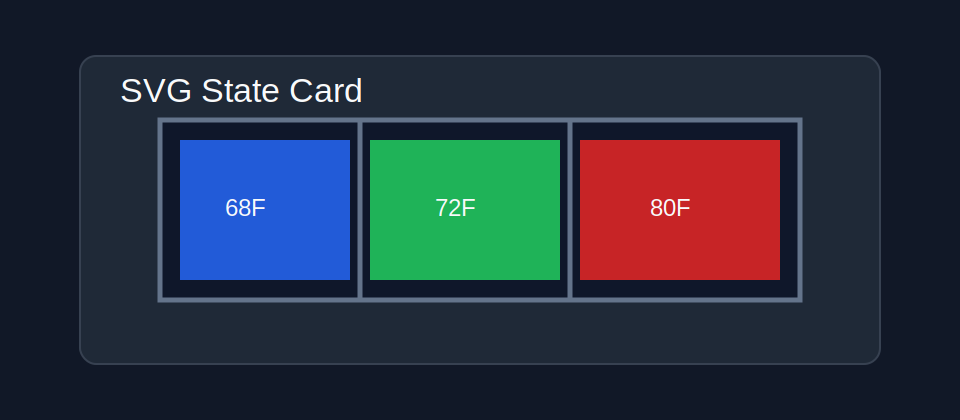

# SVG State Card

SVG State Card is a Home Assistant Lovelace card for coloring and controlling id'd SVG elements from entity state.

It is intended for focused SVG dashboards such as HVAC zone maps, floor heat maps, equipment diagrams, and other views where a full floorplan engine is more than you need.

## Preview



## Installation

### HACS

Add this repository as a custom repository:

```text
https://github.com/stewartoallen/svg-state-card
```

Select category **Dashboard**, install **SVG State Card**, then refresh the browser.

HACS should add the dashboard resource automatically. If needed, add it manually:

```text
/hacsfiles/svg-state-card/svg-state-card.js
```

Resource type:

```text
JavaScript module
```

### Manual Install

Copy `svg-state-card.js` into:

```text
/config/www/community/svg-state-card/svg-state-card.js
```

Add this dashboard resource:

```text
/local/community/svg-state-card/svg-state-card.js
```

Resource type:

```text
JavaScript module
```

## Example

```yaml
type: custom:svg-state-card
title: Floor Zones
svg: /local/floorplan.svg
entity_aliases:
  kitchen_temp: sensor.kitchen_temperature
  kitchen_heat: switch.kitchen_floor_heat
  bedroom_heat: switch.bedroom_floor_heat
display_defaults:
  min: 65
  max: 80
  min_color: "#2563eb"
  color_70: "#22c55e"
  color_75: "#facc15"
  max_color: "#dc2626"
tap_action:
  action: more-info
double_tap_action:
  action: toggle
display:
  - id: kitchen_zone
    entity_alias: kitchen_temp
  - id: bedroom_zone
    entity_alias: bedroom_heat
    state_colors:
      "on": "#f97316"
      "off": "#334155"
action:
  - id: kitchen_zone_tap
    display_id: kitchen_zone
    entity_alias: kitchen_heat
    double_tap_action:
      action: toggle
  - id:
      - bedroom_zone
      - bedroom_overlay
    entity_alias: bedroom_heat
    tap_action:
      action: toggle
```

## Options

| Option | Type | Default | Description |
| --- | --- | --- | --- |
| `svg` | string | required | SVG URL, usually `/local/...`. |
| `entity_aliases` | object | `{}` | Local alias-to-entity-id map for this card. |
| `display_defaults` | object | `{}` | Default color/styling options applied to every `display` and `zones` entry. |
| `display` | list | `[]` | SVG element bindings that receive runtime fill/stroke/opacity. |
| `action` | list | `[]` | SVG element bindings that receive tap/double-tap actions. |
| `zones` | list | `[]` | Compact compatibility form that combines `display` and `action`. |
| `title` | string | none | Card title. Omit to hide. |
| `preserve_aspect_ratio` | string | `xMidYMid meet` | Root SVG `preserveAspectRatio` value. The SVG is scaled to fit card width. |
| `tap_action` | object/string | `more-info` | Default tap action. |
| `double_tap_action` | object/string | none | Default double-tap action. |
| `hold_action` | object/string | none | Default long-press action. |
| `double_tap_window_ms` | number | `260` | Time window for double-tap detection. |
| `hold_time_ms` | number | `500` | Long-press threshold. Alias: `long_press_ms`. |
| `display[].id` | string/list | required | SVG element id or ids to style. |
| `display[].entity_id` | string | none | Home Assistant entity id used for color. |
| `display[].entity_alias` | string | none | Key from `entity_aliases` used for color. |
| `display[].min` | number | none | Numeric color range minimum. |
| `display[].max` | number | none | Numeric color range maximum. |
| `display[].min_color` | color | none | Color at `min`. Alias: `color_min`. |
| `display[].max_color` | color | none | Color at `max`. Alias: `color_max`. |
| `display[].color_<number>` | color | none | Additional numeric interpolation stop. |
| `display[].color_stops` | object | none | Numeric value-to-color map. |
| `display[].state_colors` | object | none | State-to-color map. Keys can use `|` aliases. |
| `display[].default_color` | color | none | Fallback fill color. |
| `display[].stroke` | color | none | Runtime stroke color. |
| `display[].opacity` | number | none | Runtime opacity. |
| `display[].state_opacity` | object | none | State-to-opacity map. Keys can use `|` aliases. |
| `display[].tap_action` | object/string | card default | Tap action inherited by linked action bindings. |
| `display[].double_tap_action` | object/string | card default | Double-tap action inherited by linked action bindings. |
| `display[].hold_action` | object/string | card default | Long-press action inherited by linked action bindings. |
| `action[].id` | string/list | required | SVG element id or ids that receive actions. |
| `action[].display_id` | string/list | none | Display binding id or ids used for inherited tap behavior. |
| `action[].entity_id` | string | none | Default action target entity. |
| `action[].entity_alias` | string | none | Key from `entity_aliases` used as the default action target. |
| `action[].tap_action` | object/string | card default | Tap action. |
| `action[].double_tap_action` | object/string | card default | Double-tap action. |
| `action[].hold_action` | object/string | card default | Long-press action. |

## Actions

Supported actions:

- `more-info`
- `toggle`
- `navigate`
- `call-service`
- `none`

Examples:

```yaml
tap_action:
  action: more-info

double_tap_action:
  action: toggle
  entity_id: switch.kitchen_floor_heat

double_tap_action:
  action: toggle
  entity_alias: kitchen_heat

hold_action:
  action: more-info
  entity_alias: kitchen_temp

tap_action:
  action: call-service
  service: switch.turn_on
  service_data:
    entity_id: switch.kitchen_floor_heat
```

## SVG Notes

The SVG is fetched and inlined into the card so elements can be found by `id`.

The source SVG file is not modified. Runtime styling is applied in the browser with inline styles.

Display color and styling options can be set globally with `display_defaults`, or directly at the card root. Per-display values override the global values:

```yaml
display_defaults:
  min: 65
  max: 80
  min_color: "#2563eb"
  color_70: "#22c55e"
  color_75: "#facc15"
  max_color: "#dc2626"

display:
  - id: kitchen_heat_area
    entity_alias: kitchen_temp
  - id: server_room
    entity_id: sensor.server_room_temperature
    max: 95
    max_color: "#7e22ce"
```

Display and action elements can be separate. Prefer `display` for the SVG element or elements that should be colored, and `action` for transparent overlays or other SVG elements that should receive tap/double-tap actions:

```yaml
entity_aliases:
  kitchen_temp: sensor.kitchen_temperature
  kitchen_dining_heat: switch.kitchen_dining_floor_heat

display:
  - id:
      - kitchen_heat_area
      - dining_heat_area
    entity_alias: kitchen_temp

action:
  - id: kitchen_dining_overlay
    display_id:
      - kitchen_heat_area
      - dining_heat_area
    entity_alias: kitchen_dining_heat
    double_tap_action: toggle
```

When an action binding has `display_id`, tap behavior can be inherited from the linked display binding. This is useful when tap should show information for a sensor, while double-tap controls a different entity:

```yaml
display:
  - id: kitchen_heat_area
    entity_alias: kitchen_temp
    tap_action: more-info

action:
  - id: kitchen_heat_overlay
    display_id: kitchen_heat_area
    entity_alias: kitchen_heat
    double_tap_action: toggle
```

In this example, tapping the overlay opens more-info for `kitchen_temp`; double-tapping toggles `kitchen_heat`.

The reverse pattern is also supported:

```yaml
display:
  - id: kitchen_heat_area
    entity_alias: kitchen_temp
    double_tap_action: more-info

action:
  - id: kitchen_heat_overlay
    display_id: kitchen_heat_area
    entity_alias: kitchen_heat
    tap_action: toggle
```

In linked bindings, `action` values override `display` values. If an action binding omits `tap_action`, `double_tap_action`, or `hold_action`, the card falls back to the linked display binding before using the card default.

Long-press follows the same inheritance rules:

```yaml
display:
  - id: kitchen_heat_area
    entity_alias: kitchen_temp
    hold_action: more-info

action:
  - id: kitchen_heat_overlay
    display_id: kitchen_heat_area
    entity_alias: kitchen_heat
    tap_action: toggle
```

The compact `zones` form is also supported:

```yaml
zones:
  - id:
      - kitchen_heat_area
      - dining_heat_area
    action_id: kitchen_dining_overlay
    entity_id: sensor.kitchen_temperature
    action_entity_id: switch.kitchen_dining_floor_heat
    tap_action: more-info
    double_tap_action: toggle
```

Remove scripts and inline event handlers from SVGs. The card strips `<script>` tags and `on...` attributes before rendering, but SVGs should still be treated as trusted local assets.

## Development

Run the syntax check:

```bash
npm run check
```
